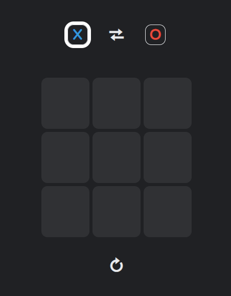
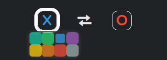
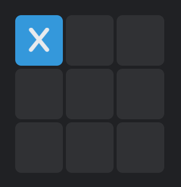
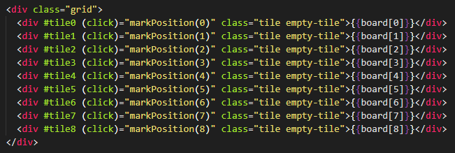

# Juego Tic Tac Toe en Angular

Este projecto consiste en una simple implementación del juego Tic Tac Toe (también conocido como gato) para dos jugadores, utilizando el framework de JavaScript para front-end, Angular. 

## Objetivo

El principal objetivo de crear este proyecto utilizando Angular es para entender y practicar las funcionalidad básicas del framework. 

## Conceptos de Angular utilizados

Entre las funcionalidades de Angular que se usaron en la implementación del juego se encuentran:

- ``Interpolación``. Se utilizó la interpolación simple de cadenas para establecer los valores que tendrá cada casilla del tablero.
- Directiva ``*ngFor``. Se utilizó la directiva ngFor perteneciente a Angular para simplificar el código al momento de crear el menú de colores. 
- Directiva ``ngClass``. Mediante el uso de la directiva ngClass se permitió asignar clases CSS dinámicamente a los elementos HTML para modificar su comportamiento.
- Manejo de ``evento click``. Para permitir la interacción con el usuario, se utilizó el enlace de evento "click" para capturar cuando se de clic sobre alguna casilla del tablero o cualquier elemento de la aplicación.
- ``Variables de plantilla``. Las variables de plantilla se utilizaron para definir cada una de las casillas del tablero, y así poder acceder a ellas desde TypeScript.
- Decorador ``ViewChild``. Se utilizó el decorador ViewChild para acceder a cada una de las casillas del tablero mediante variables de plantilla.

Debido a la simpleza de la aplicación, no se implementa ningún sistema de enrutamiento.

## Funcionamiento de la aplicación

Al abrir la aplicación, se muestra la siguiente interfaz:

Desde esta interfaz se puede acceder a todas las funcionalidades de la aplicación. El turno actual se representa con un borde grueso de color blanco alrededor del símbolo del jugador que le corresponda tirar. La interfaz está dividida en 3 partes:

### Cabecera

En esta sección se encuentra el indicador del jugador que posee el turno actual. También se muestra el color con el que se representa a cada jugador. Al hacer click en el botón central, se cambia el orden de los jugadores; en caso de que alguna partida esté empezada, se reinicia automaticamente. 

Si se pasa el mouse encima del símbolo de algún jugador, se muestra un pequeño menú flotante que permite cambiar el color para el jugador seleccionado; cambiar de color no afecta el juego actual. No se permite elegir el mismo color que el adversario tiene seleccionado.

### Tablero

En esta sección se encuentra el tablero donde se podrá jugar Tic Tac Toe. 

Al pasar el mouse sobre alguna casilla, esta se colorea parcialmente del color que tenga seleccionado el jugador con el turno actual. Al dar click sobre alguna casilla, se marca el interior de esta con el símbolo ( `X` o `O` ) del jugador con el turno actual. 

Para construir el tablero, se crearon 9 elementos con la etiqueta HTML ``div``. 

Cada elemento tiene las siguiente características:
- Una variable de plantilla identificada por el prefijo `tile` y seguido por el número de casilla actual. Esta variable de plantilla se utiliza dentro del código del componente; mediante el decorador `ViewChild`, se obtiene su referencia al elemento del DOM, la cual se utilizará para acceder a las clases CSS.
- Un enlace de evento `click` que llama a la función `markPosition()`, la cual se encuentra dentro del código del componente. Esta función busca si la posicion seleccionada está libre; si ese es el caso, entonces la marca con el simbolo del jugador con el turno actual, comprueba si ganó el jugador o si existe un empate, y por último cambia el turno actual.
- Una interpolación de cadena para mostrar el contenido de la partida actual. Este array es el que se modifica y actualiza dentro del código del componente, posee el estado de la partida actual.

### Footer

En la parte inferior del tablero, unicamente se encuentra un botón que permite reiniciar la partida actual. Al hacer click sobre el botón, se utiliza el enlace de evento ``click`` para llamar a la función ``reset()`` dentro del código del componente.

Se puede probar la aplicación [aquí](https://abiudsal.github.io/tic-tac-toe-angular)

## Uso de Angular (autogenerado)

This project was generated with [Angular CLI](https://github.com/angular/angular-cli) version 12.2.5.

### Development server

Run `ng serve` for a dev server. Navigate to `http://localhost:4200/`. The app will automatically reload if you change any of the source files.

### Code scaffolding

Run `ng generate component component-name` to generate a new component. You can also use `ng generate directive|pipe|service|class|guard|interface|enum|module`.

### Build

Run `ng build` to build the project. The build artifacts will be stored in the `dist/` directory.

